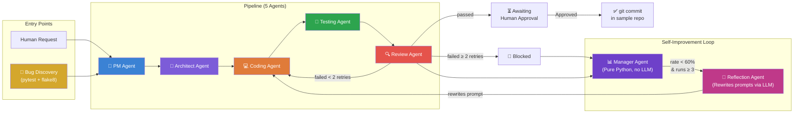

<p align="center">
  <h1 align="center">🤖 AI Dev Team in a Box</h1>
  <p align="center">
    <strong>A multi-agent AI engineering team that builds features, fixes bugs, reviews its own work, and measurably improves itself over time.</strong>
  </p>
  <p align="center">
    Multi-Agent Software Engineering · Powered by Groq
  </p>
</p>

---

## The One-Sentence Pitch

> A human types a feature request. Five AI agents process it into a reviewed, tested code change. A Manager watches for failures, a Reflection Agent rewrites the failing agent's prompt, and a live dashboard proves the system genuinely gets smarter — not with slides, but with a graph that climbs.

---
##🎯🎯🎯 DEPLOYED LINK : https://ibmpro1-g7bjwu2xf2vfdgyaxmuxm5.streamlit.app/

## Architecture



---

## Key Features

### 🔄 Self-Improvement That Actually Works
Not "the agent retries." The system **diagnoses which agent is failing**, **identifies the specific failure pattern** (e.g., "missing input validation"), and **rewrites that agent's system prompt** with targeted fixes. The dashboard graph shows the success rate dip and recover — that's real, measurable improvement.

### 🛡️ Human-in-the-Loop, Always
No AI-generated code ever touches disk without a human clicking Approve. Every approved fix becomes a real, reversible `git commit` in the sample repo's history. Rejected diffs? They still update the Manager's stats so the system learns from them.

### 📋 Zero Information Loss
Every agent reads and writes to the **same JSON task object** — no paraphrasing, no re-summarizing between hops. Each agent's wrapper does an **allowlist merge** (copies only its own fields), so an LLM hallucinating extra keys can never overwrite `status` or `retry_count`.

### 🐛 Two Entry Points
**Feature requests** typed by a human, or **bugs discovered automatically** by scanning the repo with pytest + flake8. Both flow through the same pipeline, same approval process, same dashboard.

### 💰 Cost-Aware Design
Manager Agent and Bug Discovery are **pure Python — zero LLM calls**. Reflection Agent only fires when needed (rate < 60%, ≥ 3 runs). A clean pipeline run costs only the 5 worker agent calls.

---

## Quick Start

```bash
# 1. Clone and install
git clone <repo-url>
cd ai-dev-team
pip install -r requirements.txt

# 2. Configure (copy template, add your Groq API key)
cp .env.example .env
# Edit .env with your GROQ_API_KEY (get one at https://console.groq.com)

# 3. Run the demo (simulates the full self-improvement story)
python demo.py --fresh

# 4. Open the dashboard
python -m streamlit run dashboard/app.py
```

### Run a real pipeline:
```bash
python orchestration/pipeline.py --request "Add rate limiting to the login endpoint"
```

The pipeline can target any text or structured file inside the directory passed with
`--repo`, not only FlaskBB files. For example:
```powershell
python orchestration/pipeline.py --repo sample_repo/flaskbb --request "Modify train.py to print a random number from 1 to 10."
```
Requests are limited to five scoped files and still require human approval before changes
are applied. Binary files, secrets, path traversal, and files outside `--repo` are rejected.

Blocked tasks that already contain a generated diff can be intentionally overridden in the
dashboard: open Human Sign-off, check the blocked-task confirmation, and choose **Approve
Blocked Diff**. The task is then marked `approved` and can be applied with `apply_fixes.py`.
Blocked tasks without a generated diff cannot be overridden because there is no change to apply.

For quicker local verification of a small change, add `--fast`. This tests the patched copy
without the separate baseline run and records that full regression comparison was skipped:
```powershell
python orchestration/pipeline.py --repo sample_repo/flaskbb --fast --request "Modify train.py to print a random number from 1 to 10."
```
Normal mode remains the recommended choice before approval. Testing timeouts can be adjusted
with `TESTING_AGENT_PYTEST_TIMEOUT` and `TESTING_AGENT_API_TIMEOUT` (seconds).

If the pipeline appears to pause at the Testing Agent during a local demo, use the
deterministic local judge to skip the LLM testing-interpretation call:
```powershell
$env:TESTING_AGENT_LOCAL_JUDGE="1"
python orchestration/pipeline.py --repo sample_repo/flaskbb --fast --request "Modify train.py to print a random number from 1 to 10."
```
The target repo still needs its own dependencies for meaningful pytest results. Agent
unit tests can be run independently with `python -m pytest agents orchestration -q`.

### Scan for bugs and fix them:
```bash
python orchestration/scan.py --source sample_repo/flaskbb/flaskbb
# Select bugs in dashboard → Mark Selected
python orchestration/scan.py --source sample_repo/flaskbb/flaskbb --run-selected
```

### Apply approved fixes:
```bash
python orchestration/apply_fixes.py --repo sample_repo/flaskbb
```

---

## Project Structure

```
ai-dev-team/
├── agents/
│   ├── pm_agent/            # Writes acceptance criteria
│   ├── architect_agent/     # Plans implementation + scopes files
│   ├── coding_agent/        # Generates unified diff
│   ├── testing_agent/       # Validates diff against criteria
│   ├── review_agent/        # Security/quality checklist
│   ├── manager_agent/       # Tracks stats, flags underperformers (pure Python)
│   ├── reflection_agent/    # Rewrites failing agent's prompt (LLM call)
│   ├── bug_discovery_agent/ # Scans repo with pytest + flake8 (pure Python)
│   └── scaffold_agent/      # Plans from-scratch project builds
├── orchestration/
│   ├── pipeline.py          # Main 5-agent pipeline with retry loop
│   ├── apply_fixes.py       # git apply → pytest → git commit
│   ├── scan.py              # Bug discovery CLI
│   ├── build.py             # From-scratch project builder
│   └── iam_auth.py          # Groq LLM API authentication
├── dashboard/
│   ├── app.py               # Streamlit dashboard (6 tabs)
│   ├── run_history.json     # Pipeline run data
│   ├── bugs.json            # Discovered bugs
│   └── tasks/               # Per-task JSON files
├── schemas/
│   └── task_schema.json     # The contract every agent reads/writes
├── sample_repo/
│   └── flaskbb/             # Real Flask forum app (target codebase)
├── demo.py                  # One-command demo script
├── requirements.txt
├── .env.example
└── .flake8
```

---

## Pipeline — Step by Step

This is exactly what happens when you run:
```bash
python orchestration/pipeline.py --repo sample_repo/flaskbb --request "your feature request"
```

### Stage 1 — PM Agent
**Input:** Plain-English feature request from the human

**What it does:**
- Reads the feature request
- Calls the Groq LLM to generate 2–6 concrete, testable acceptance criteria
- Validates the output (non-empty list, no duplicates)

**Output added to task:** `acceptance_criteria`

**On failure:** Pipeline halts immediately → task status = `blocked`

---

### Stage 2 — Architect Agent (up to 2 attempts)
**Input:** `feature_request` + `acceptance_criteria` + full repo file listing

**What it does:**
- Scans the repository file tree (up to 150 files)
- Calls the Groq LLM to decide which files need changing (max 5)
- Writes a plain-English implementation plan
- Validates: files must exist on disk OR be declared as `NEW FILE:` in the plan
- Gets a second attempt automatically if the first LLM response is invalid

**Output added to task:** `plan`, `scoped_files`

**On failure:** Pipeline halts → task status = `blocked`

---

### Stage 3 — Coding Agent
**Input:** `plan` + `scoped_files` + actual content of every scoped file

**What it does:**
- Reads the full content of each scoped file and sends it to the Groq LLM
- Instructs the model to return a valid unified diff (`--- a/file`, `+++ b/file`, `@@ hunk markers`)
- Validates the diff format (must contain `---`, `+++`, `@@`)
- If the LLM returns incomplete JSON (token limit), extracts the diff via regex fallback

**Output added to task:** `code_diff`

**On failure:** Task status = `blocked` → skips to Manager Agent

---

### Stage 4 — Testing Agent
**Input:** `code_diff` + `acceptance_criteria` + `scoped_files`

**What it does:**
- Applies the diff to a temp copy of the repo
- Runs `pytest` on the patched copy
- Calls the Groq LLM to interpret test output against acceptance criteria
- Falls back to a deterministic local judge if the LLM is unavailable (`TESTING_AGENT_LOCAL_JUDGE=1`)

**Output added to task:** `test_results`

**On failure:** Task status = `needs_retry` (up to 2 retries back to Coding Agent)

---

### Stage 5 — Review Agent
**Input:** `code_diff` + `acceptance_criteria` + `test_results`

**What it does:**
- Calls the Groq LLM to run a security + quality checklist on the diff
- Checks for: hardcoded secrets, SQL injection, input validation, scope creep
- Scores findings as HIGH / MEDIUM / LOW severity

**Output added to task:** `review_result`

**Decision logic:**
- No HIGH findings → `status = awaiting_human_approval`
- HIGH findings → `status = needs_retry` (sent back to Coding Agent)
- After 2 retries with HIGH findings → `status = blocked`

---

### Stage 6 — Human Sign-off
**Input:** Completed task with `code_diff`, `test_results`, `review_result`

**What it does:**
- Shows the diff, acceptance criteria, test results, and review findings in the dashboard
- Human clicks **Approve Diff** or **Reject Diff**
- Approved tasks are saved with `status = approved`

**This is the only stage with zero LLM involvement.**

---

### Stage 7 — Apply Fixes
**Triggered manually:**
```bash
python orchestration/apply_fixes.py --repo sample_repo/flaskbb
```

**What it does:**
1. Finds all tasks with `status = approved`
2. Tries `git apply` on the diff → falls back to direct Python file write if git fails
3. Runs `pytest` on the patched repo to confirm nothing broke
4. Creates a real, reversible `git commit` with the change
5. Updates task status to `verified_fixed`

---

### After Every Run — Manager + Reflection Loop
**Runs automatically after every pipeline execution (pure Python, no LLM):**

**Manager Agent:**
- Reads the last 5 runs for each agent
- Computes success rate per agent
- If `rate < 60%` AND `runs ≥ 3` → flags agent as underperformer

**Reflection Agent (only fires for underperformers):**
- Loads the failing agent's current `system_prompt.md`
- Calls the Groq LLM to rewrite it, targeting the specific failure pattern
- Validates: change summary must be ≥ 40 chars and reference the failure pattern
- Saves new version to `prompt_history/{agent}_v{n}.md`
- Overwrites the live `system_prompt.md` with the improved version
- Next pipeline run uses the new prompt automatically

---

### Full Flow Diagram

```
Human request
     │
     ▼
┌─────────────┐     blocked      ┌─────────────────┐
│  PM Agent   │ ───────────────► │  Manager Agent  │
│ (LLM call)  │                  │  (pure Python)  │
└──────┬──────┘                  └────────┬────────┘
       │ acceptance_criteria              │ rate < 60%
       ▼                                  ▼
┌──────────────────┐            ┌──────────────────┐
│ Architect Agent  │            │ Reflection Agent │
│  (LLM call x2)  │            │   (LLM call)     │
└────────┬─────────┘            │ rewrites prompt  │
         │ plan + scoped_files  └──────────────────┘
         ▼
┌─────────────────┐   needs_retry (max 2x)
│  Coding Agent   │ ◄─────────────────────────┐
│  (LLM call)     │                           │
└────────┬────────┘                           │
         │ code_diff                          │
         ▼                                    │
┌─────────────────┐                           │
│ Testing Agent   │                           │
│ (pytest + LLM)  │                           │
└────────┬────────┘                           │
         │ test_results                       │
         ▼                                    │
┌─────────────────┐  HIGH findings ───────────┘
│  Review Agent   │
│  (LLM call)     │
└────────┬────────┘
         │ awaiting_human_approval
         ▼
┌─────────────────┐
│  Human Sign-off │  ← Dashboard
│  (no LLM)       │
└────────┬────────┘
         │ approved
         ▼
┌─────────────────┐
│  apply_fixes.py │
│  git apply/write│
│  + git commit   │
└─────────────────┘
```

---

## How Self-Improvement Works

```
1. Pipeline runs → each agent's success/failure logged in task.history

2. Manager Agent (pure Python) computes rolling-window success rate:
   rate = successes / runs  (window = last 5 runs)

3. Canonical trigger rule:
   IF rate < 0.6 AND runs ≥ 3 → flag as underperformer

4. Manager extracts specific failure patterns:
   e.g., "missing input validation", "diff touched files outside scoped_files"

5. Reflection Agent receives:
   - Current system prompt
   - Concrete failure examples
   - Named failure patterns

6. Reflection Agent (LLM call) rewrites the prompt
   → Validated: change_summary ≥ 40 chars, must reference a failure pattern
   → Versioned: saved as prompt_history/{agent}_v{n}.md
   → Applied: overwrites live system_prompt.md

7. Next pipeline run uses the new prompt → rate recovers
   → Dashboard graph shows the climb in real-time
```

---

## Tech Stack

| Component | Technology |
|-----------|-----------|
| Language | Python |
| LLM | Groq Cloud (LLama 3.3 70B Versatile) |
| Dashboard | Streamlit + Plotly |
| Testing | pytest |
| Static Analysis | flake8 |
| Schema Validation | jsonschema (JSON Schema draft-07) |
| Version Control | git (real commits in sample repo) |
| Sample Repo | FlaskBB (Flask forum, SQLite) |

---

## Command Center Dashboard

The live Streamlit command center features 10 comprehensive tabs:

| Tab | Capability & Impact |
|-----|--------------------|
| **🏠 Executive Overview** | Hero KPI cards, interactive architecture Sankey diagram, real-time activity feed, ROI economics calculator |
| **🚀 Launch Pipeline** | Interactive in-browser feature dispatcher with live step-by-step agent execution animations |
| **🐛 Bug Scanner** | Unified Flake8 AST & Pytest behavioral scanner with 1-click batch fix queueing |
| **📈 Performance & Timings** | Rolling success rates with Reflection trigger markers and per-agent execution duration telemetry |
| **📝 Prompt Evolution** | Side-by-side prompt diff viewer with 1-click Autonomous Rollback to previous stable version |
| **🔍 Human Sign-off & PR** | Human-in-the-loop review gate, code patch viewer, Consensus Confidence badge, 1-click GitHub PR export |
| **⚡ Self-Healing Sandbox** | Live interactive vulnerability injector & multi-turn agent self-correction simulator |
| **🏗️ Generated Projects** | From-scratch multi-file project builder tracking sequential 5-file reviewed batches |
| **🛡️ Code Modernizer** | Automated repository architecture auditor, PEP 484 type annotator & security hardening advisor |
| **🎮 Live Demo Controller** | 1-click end-to-end self-improvement simulation runner & test suite executor |

---

## Tests & Quality Assurance

```bash
# Run all 266 unit & integration tests (0 failures, executes in ~0.5s):
pytest
```

- **100% Mocked Isolation:** All Groq LLM calls are mocked in unit tests — zero API credits spent on tests.
- **Flake8 Compliance:** 0 lint errors across all 9 agents, orchestrators, and dashboard (`flake8`).
- **Fail-Proof Runtime:** Protected by in-memory AST syntax checker, Circuit Breaker, Consensus Arbiter, and Prompt Rollback Engine.

---

## Team

AI Dev Team — Multi-Agent Software Engineering


---
